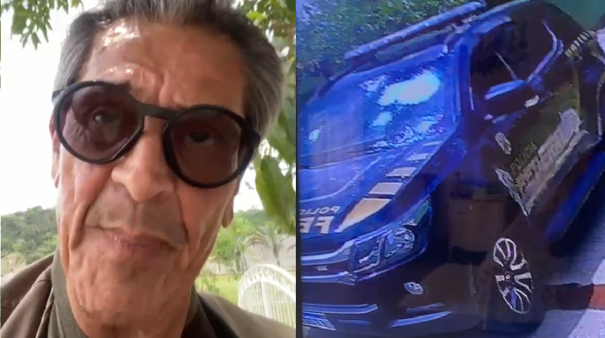

# Jornal

# **Roberto Jefferson resiste à prisão e atira contra policiais federais no RJ**
---
##### De acordo com a Polícia Federal, dois agentes foram atingidos por estilhaços durante cumprimento de ordem de prisão

 

**[Da CNN](https://www.cnnbrasil.com.br/politica/roberto-jefferson-diz-em-video-ter-atirado-contra-policiais-federais-no-rj/)** da CNN

23/10/2022 às 14:04 | Atualizado 23/10/2022 às 15:36

O ex-deputado federal Roberto Jefferson disparou contra policiais federais que foram até sua casa, no interior do Rio de Janeiro, neste domingo (23), na tentativa de prendê-lo. Nesta segunda-feira (24) a Procuradoria-Geral da República (PGR) deve apresentar um pedido ao Supremo Tribunal Federal (STF) para que o ex parlamentar tenha a prisão domiciliar revogada e volte para o regime fechado. A motivação da medida ocorreu após o ex-deputado postar um vídeo com ofensas à ministra Cármen Lúcia, do STF.

Uma das medidas que ele deveria cumprir na prisão domiciliar é não participar de redes sociais. Nos últimos dias, surgiu um vídeo em que o ex-deputado profere ofensas de baixo calão contra a ministra Cármen Lúcia, do Supremo Tribunal Federal (STF), ao reclamar de decisão tomada por ela

De acordo com a Polícia Federal do Rio de Janeiro, agentes federais foram à casa do ex-deputado para cumprir uma ordem de prisão do STF, e durante a diligência, na manhã de hoje, o alvo reagiu à abordagem se preparavam para entrar na residência. Dois policiais foram atingidos por estilhaços, mas passam bem, segundo a corporação.

O presidente Jair Bolsonaro (PL) disse neste domingo (23) repudiar a atitude do ex-parlamentar em uma publicação em seu perfil no Twitter.

O próprio ex-deputado filmou o carro da Polícia Federal em frente à sua cara e enviou vídeos onde contou como foi a abordagem dos policiais. Ele afirma que atirou na direção deles.

“Chega de opressão, eles já me humilharam muito, minha família. Mas eu não estou atirando em cima deles, eu dei perto, mas não atirei neles”, diz Jefferson no vídeo, quando uma voz feminino ao fundo fala “arrebentou o vidro”.
